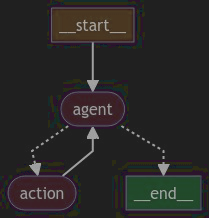

# 持久化

在构建和管理复杂的人工智能应用时，**记忆（Memory）** 是一个关键的组件，它允许系统在多次交互中共享上下文和状态，从而提供更连贯和智能的响应。

在 LangGraph 框架中，通过 [Checkpointers](https://langchain-ai.github.io/langgraph/reference/checkpoints/)
为 [StateGraph](https://langchain-ai.github.io/langgraph/reference/graphs/) 提供了记忆功能。

在 LangGraph 中，为了持久化工作流的状态，你可以使用 Checkpointer，

例如 AsyncSqliteSaver，并在编译图时将其作为参数传递给 compile 方法。

这样可以确保你的图在执行过程中能够持久化其状态，并在需要时进行恢复。

关键步骤概述

1. 导入必要模块：导入 StateGraph 和 AsyncSqliteSaver。
2. 定义图：通过 StateGraph 构建你的图，并定义所需的节点和逻辑。
3. 设置 Checkpointer：使用 AsyncSqliteSaver 来保存图的状态。
4. 编译图：在调用 compile 方法时，传递 checkpointer 参数，以启用状态持久化功能。

```python

from langgraph.graph import StateGraph
from langgraph.checkpoint.aiosqlite import AsyncSqliteSaver

builder = StateGraph(....)
# ... define the graph
memory = AsyncSqliteSaver.from_conn_string(":memory:")
graph = builder.compile(checkpointer=memory)
...

```

这适用于 StateGraph 及其所有子类，例如 MessageGraph。

以下是一个示例。

> 注意：在本教程中，我们将从头开始创建我们的代理，以保持透明（但冗长）。你也可以使用 create_react_agent(model, tools=tool,
> checkpointer=checkpointer)
> [（API 文档）](https://langchain-ai.github.io/langgraph/reference/prebuilt/#create_react_agent)构造函数实现类似的功能。
> 如果你习惯于 LangChain
> 的 [AgentExecutor](https://python.langchain.com/v0.1/docs/modules/agents/concepts/#agentexecutor) 类，这可能更合适。

## 设置

安装依赖包

```shell
!pip install --quiet -U langgraph langchain_anthropic

```

接下来，我们需要设置 OpenAI（我们将使用的 LLM）和 Tavily（我们将使用的搜索工具）的 API 密钥。

```python
import os
import getpass

def _set_env(var: str):
    if not os.environ.get(var):
        os.environ[var] = getpass.getpass(f"{var}: ")

_set_env("ANTHROPIC_API_KEY")

```

## 设置状态

State状态是所有节点的接口。

```python

from typing_extensions import TypedDict
from typing import Annotated
from langgraph.graph.message import add_messages

# Add messages essentially does this with more
# robust handling
# def add_messages(left: list, right: list):
#     return left + right


class State(TypedDict):
    messages: Annotated[list, add_messages]

```

## 设置工具

我们首先会定义我们想要使用的工具。对于这个简单的示例，我们将创建一个占位符搜索引擎。

不过，创建自己的工具非常简单 - 这里因为演示的是持久化，可以暂时不用实现tool的具体功能。

```python

from langchain_core.tools import tool

@tool
def search(query: str):
    """Call to surf the web."""
    # This is a placeholder for the actual implementation
    return ["The answer to your question lies within."]


tools = [search]

```

现在我们可以创建我们的工具节点[（ToolNode）](https://langchain-ai.github.io/langgraph/reference/prebuilt/?h=tool+node#create_react_agent)
。这个对象实际上运行了 LLM 要求使用的工具（也称为函数）。

```python
from langgraph.prebuilt import ToolNode

tool_node = ToolNode(tools)
    
```

## 设置模型

现在我们需要加载聊天模型来支持我们的代理。对于下面的设计，它必须满足两个条件：

* 它应该能够处理消息（因为我们的状态包含一系列聊天消息）
* 它应该能够处理工具调用。

> 注意：这些模型要求并不是使用 LangGraph 的通用要求 - 它们只是这个示例的要求。

```python

from langchain_openai import ChatOpenAI

temperature = 0.5
streaming = False

# We will set streaming=True so that we can stream tokens
# See the streaming section for more information on this.
llm_name = 'gpt-3.5-turbo'
OPENAI_API_KEY="YOU_OPENAPI_KEY"

model = ChatOpenAI(
        model=llm_name,
        temperature=temperature,
        streaming=streaming,
        api_key=OPENAI_API_KEY,
    )
    
```
> 在完成这些操作后，我们应确保模型知道它可以调用这些工具。

我们可以通过将 LangChain 工具转换为适用于 OpenAI 函数调用的格式，然后将它们绑定到模型类来实现这一点

```python
model = model.bind_tools(tools)

```

## 定义节点

现在我们需要在我们的流程图中定义几个不同的节点。在 langgraph 中，一个节点可以是一个函数function或可运行runnable的对象。对于这个任务，我们需要两个主要的节点：

1. 代理节点：负责决定是否要执行某些操作。
2. 调用工具的函数节点：如果代理决定执行某些操作，那么这个节点将执行该操作。

我们还需要定义一些边。其中一些边可能是有条件的。它们之所以有条件，是因为根据节点的输出，可能会采取多种路径之一。所采取的路径直到运行该节点时才知道（由 LLM 决定）。

1. 条件边：在调用代理之后，我们应该执行以下操作之一：

a. 如果代理说要采取行动，那么应该调用函数来调用工具。
b. 如果代理说它已经完成了，那么它应该结束。

2. 普通边：在调用工具后，应该总是返回到代理，以决定接下来要做什么。

让我们来定义这些节点，以及一个函数来决定采用哪种条件边。

```python

# Define the function that determines whether to continue or not
from typing import Literal

# 条件边
def should_continue(state: State) -> Literal["action", "__end__"]:
    """Return the next node to execute."""
    last_message = state["messages"][-1]
    # If there is no function call, then we finish
    if not last_message.tool_calls:
        return "__end__"
    # Otherwise if there is, we continue
    return "action"


# Define the function that calls the model
def call_model(state: State):
    response = model.invoke(state["messages"])
    # We return a list, because this will get added to the existing list
    return {"messages": response}
```

## 定义流程图
现在我们可以把所有的东西放在一起，定义图了！

```python

from langgraph.graph import StateGraph, END

# Define a new graph
workflow = StateGraph(State)

# Define the two nodes we will cycle between
workflow.add_node("agent", call_model)
workflow.add_node("action", tool_node)

# Set the entrypoint as `agent`
# This means that this node is the first one called
workflow.set_entry_point("agent")

# We now add a conditional edge
workflow.add_conditional_edges(
# First, we define the start node. We use `agent`.
# This means these are the edges taken after the `agent` node is called.
"agent",
# Next, we pass in the function that will determine which node is called next.
should_continue,
)

# We now add a normal edge from `tools` to `agent`.
# This means that after `tools` is called, `agent` node is called next.
workflow.add_edge("action", "agent")

```

## 持久化

要添加持久化功能，我们在编译图时传入一个检查点。


```python
from langgraph.checkpoint.sqlite import SqliteSaver

memory = SqliteSaver.from_conn_string(":memory:")

```

```python

# Finally, we compile it!
# This compiles it into a LangChain Runnable,
# meaning you can use it as you would any other runnable
app = workflow.compile(checkpointer=memory)

```

```python
from IPython.display import Image, display

try:
    display(Image(app.get_graph().draw_mermaid_png()))
except:
    # This requires some extra dependencies and is optional
    pass
```



## 与代理交互

现在我们可以与代理进行交互，并看到它记得之前的消息！


```python
from langchain_core.messages import HumanMessage

config = {"configurable": {"thread_id": "2"}}
input_message = HumanMessage(content="hi! I'm bob")
for event in app.stream({"messages": [input_message]}, config, stream_mode="values"):
    event["messages"][-1].pretty_print()

```

================================ Human Message =================================

hi! I'm bob
================================== Ai Message ==================================

Hello Bob! How can I assist you today?

```python
input_message = HumanMessage(content="what is my name?")
for event in app.stream({"messages": [input_message]}, config, stream_mode="values"):
    event["messages"][-1].pretty_print()
```

================================ Human Message =================================

what is my name?
================================== Ai Message ==================================

Your name is Bob.

如果我们想开始一次新的对话，我们可以传入一个不同的线程 ID。哇！所有的记忆都消失了！
    
    

```python
input_message = HumanMessage(content="what is my name?")
for event in app.stream(
    {"messages": [input_message]},
    {"configurable": {"thread_id": "3"}},
    stream_mode="values",
):
    event["messages"][-1].pretty_print()
```

================================ Human Message =================================

what is my name?
================================== Ai Message ==================================

I'm sorry, I don't know your name. Can you please tell me?


所有的检查点都持久化到了检查点管理器，因此你可以随时恢复之前的线程。

```python
input_message = HumanMessage(content="You forgot??")
for event in app.stream(
    {"messages": [input_message]},
    {"configurable": {"thread_id": "2"}},
    stream_mode="values",
):
    event["messages"][-1].pretty_print()
```

================================ Human Message =================================

You forgot??
================================== Ai Message ==================================

I apologize for that. Of course, I remember your name is Bob. How can I assist you today, Bob?
