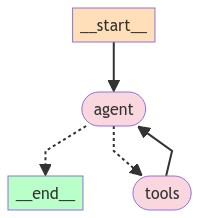

# 流响应

在这个例子中，我们将从为代理提供动力的语言模型中流式传输标记。我们将使用 ReAct 代理作为示例。这里需要牢记的主要事情是，使用异步节点通常提供了最佳的行为，因为我们将使用 astream_events 方法。

这个指南与此目录中的其他指南密切相关，所以下面我们将使用 STREAMING 标签指出其中的不同之处（如果您只想搜索这些不同之处）。

**注意**
> 在这个指南中，我们将从头开始创建我们的代理以使其透明（但冗长）。您也可以使用 create_react_agent(model, tools=tool)（API 文档）构造函数来实现类似的功能。如果您习惯于 LangChain 的 AgentExecutor 类，这可能更合适。

关于 Python < 3.11 的说明
> 当使用 Python 3.8、3.9 或 3.10 时，请确保在调用 llm 时手动通过 config 将 RunnableConfig 传递给它，如 llm.ainvoke(...)。astream_events 方法通过传递作为回调的流式跟踪器收集来自您的嵌套代码的所有事件。在 3.11 及以上版本中，这将自动通过 contextvar 处理；在 3.11 之前，asyncio 的任务缺乏正确的 contextvar 支持，这意味着只有在手动传递 config 时回调才会传播。我们在下面的 call_model 方法中执行此操作。


## 设置

安装依赖包

```shell
!pip install --quiet -U langgraph langchain_anthropic

```

接下来，我们需要设置 OpenAI（我们将使用的 LLM）和 Tavily（我们将使用的搜索工具）的 API 密钥。

```python
import os
import getpass

def _set_env(var: str):
    if not os.environ.get(var):
        os.environ[var] = getpass.getpass(f"{var}: ")

_set_env("ANTHROPIC_API_KEY")

```

## 设置状态

State状态是所有节点的接口。

```python

from typing_extensions import TypedDict
from typing import Annotated
from langgraph.graph.message import add_messages

# Add messages essentially does this with more
# robust handling
# def add_messages(left: list, right: list):
#     return left + right


class State(TypedDict):
    messages: Annotated[list, add_messages]

```

## 设置工具

我们首先会定义我们想要使用的工具。对于这个简单的示例，我们将创建一个占位符搜索引擎。

不过，创建自己的工具非常简单 - 这里因为演示的是持久化，可以暂时不用实现tool的具体功能。

```python

from langchain_core.tools import tool

@tool
def search(query: str):
    """Call to surf the web."""
    # This is a placeholder for the actual implementation
    return ["The answer to your question lies within."]


tools = [search]

```

现在我们可以创建我们的工具节点[（ToolNode）](https://langchain-ai.github.io/langgraph/reference/prebuilt/?h=tool+node#create_react_agent)
。这个对象实际上运行了 LLM 要求使用的工具（也称为函数）。

```python
from langgraph.prebuilt import ToolNode

tool_node = ToolNode(tools)
    
```

## 设置模型

现在我们需要加载聊天模型来支持我们的代理。对于下面的设计，它必须满足两个条件：

* 它应该能够处理消息（因为我们的状态包含一系列聊天消息）
* 它应该能够处理工具调用。

> 注意：这些模型要求并不是使用 LangGraph 的通用要求 - 它们只是这个示例的要求。

```python

from langchain_openai import ChatOpenAI

temperature = 0.5
streaming = False

# We will set streaming=True so that we can stream tokens
# See the streaming section for more information on this.
llm_name = 'gpt-3.5-turbo'
OPENAI_API_KEY="YOU_OPENAPI_KEY"

model = ChatOpenAI(
        model=llm_name,
        temperature=temperature,
        streaming=streaming,
        api_key=OPENAI_API_KEY,
    )
    
```
> 在完成这些操作后，我们应确保模型知道它可以调用这些工具。

我们可以通过将 LangChain 工具转换为适用于 OpenAI 函数调用的格式，然后将它们绑定到模型类来实现这一点

```python
model = model.bind_tools(tools)

```

## 定义节点

现在我们需要在我们的流程图中定义几个不同的节点。在 langgraph 中，一个节点可以是一个函数function或可运行runnable的对象。对于这个任务，我们需要两个主要的节点：

1. 代理节点：负责决定是否要执行某些操作。
2. 调用工具的函数节点：如果代理决定执行某些操作，那么这个节点将执行该操作。

我们还需要定义一些边。其中一些边可能是有条件的。它们之所以有条件，是因为根据节点的输出，可能会采取多种路径之一。所采取的路径直到运行该节点时才知道（由 LLM 决定）。

1. 条件边：在调用代理之后，我们应该执行以下操作之一：

a. 如果代理说要采取行动，那么应该调用函数来调用工具。
b. 如果代理说它已经完成了，那么它应该结束。

2. 普通边：在调用工具后，应该总是返回到代理，以决定接下来要做什么。

让我们来定义这些节点，以及一个函数来决定采用哪种条件边。

## 流式传输

我们将每个节点定义为异步函数。

**手动回调传播**
> 请注意，在下面的 call_model(state: State, config: RunnableConfig): 中，我们 a) 在节点中接受了 RunnableConfig，b) 并将其作为 llm.ainvoke(..., config) 的第二个参数传递。对于 Python 3.11 及更高版本，这是可选的。如果您使用的是较旧版本的 Python，而在使用 astream_events 时 LLM 标记未流式传输的问题，值得检查确保回调被手动传播。

```python

from langgraph.graph import StateGraph, END, START
from langchain_core.runnables import RunnableConfig
from typing import Literal


# Define the function that determines whether to continue or not
def should_continue(state: State) -> Literal["__end__", "tools"]:
    messages = state["messages"]
    last_message = messages[-1]
    # If there is no function call, then we finish
    if not last_message.tool_calls:
        return END
    # Otherwise if there is, we continue
    else:
        return "tools"


# Define the function that calls the model
async def call_model(state: State, config: RunnableConfig):
    messages = state["messages"]
    # Note: Passing the config through explicitly is required for python < 3.11
    # Since context var support wasn't added before then: https://docs.python.org/3/library/asyncio-task.html#creating-tasks
    response = await model.ainvoke(messages, config)
    # We return a list, because this will get added to the existing list
    return {"messages": response}

```

## 定义流程图
现在我们可以把所有的东西放在一起，定义图了！

```python
# Define a new graph
workflow = StateGraph(State)

# Define the two nodes we will cycle between
workflow.add_node("agent", call_model)
workflow.add_node("tools", tool_node)

# Set the entrypoint as `agent`
# This means that this node is the first one called
workflow.add_edge(START, "agent")

# We now add a conditional edge
workflow.add_conditional_edges(
    # First, we define the start node. We use `agent`.
    # This means these are the edges taken after the `agent` node is called.
    "agent",
    # Next, we pass in the function that will determine which node is called next.
    should_continue,
)

workflow.add_edge("tools", "agent")

# Finally, we compile it!
# This compiles it into a LangChain Runnable,
# meaning you can use it as you would any other runnable
app = workflow.compile()

```

```python
from IPython.display import Image, display


display(Image(app.get_graph().draw_mermaid_png()))
```



## 流式传输任意嵌套内容

上面的示例从聊天模型中流式传输标记，但您可能还有其他您希望为用户渲染的长时间运行的流式函数。虽然 LangGraph 中的单个节点不能返回生成器（因为它们在每个超级步中都被执行完成），但我们仍然可以使用类似的策略从节点内部流式传输任意自定义函数，并在图上调用 astream_events。

我们使用 RunnableGenerator 来实现这一点（您的函数将自动表现为 RunnableLambda 包装）。

下面是一个简单的示例。


```python

from langgraph.graph import StateGraph, END, START
from langchain_core.runnables import RunnableGenerator
from langchain_core.messages import AIMessage

# Define a new graph
workflow = StateGraph(State)

async def my_generator(state: State):
    messages = ["Four", "score", "and", "seven", "years", "ago", "our", "fathers", "..."]
    for message in messages:
        yield message

async def my_node(state: State, config: RunnableConfig):
    messages = []
    # Tagging a node makes it easy to filter out which events to include in your stream
    # It's completely optional, but useful if you have many functions with similar names
    gen = RunnableGenerator(my_generator).with_config(tags=["should_stream"])
    async for message in gen.astream(state):
        messages.append(message)
    return {"messages": [AIMessage(content=" ".join(messages))]}


workflow.add_node("model", my_node)
workflow.add_edge(START, "model")
workflow.add_edge("model", END)
app = workflow.compile()

```

{'chunk': 'Four'}|{'chunk': 'score'}|{'chunk': 'and'}|{'chunk': 'seven'}|{'chunk': 'years'}|{'chunk': 'ago'}|{'chunk': 'our'}|{'chunk': 'fathers'}|{'chunk': '...'}|


