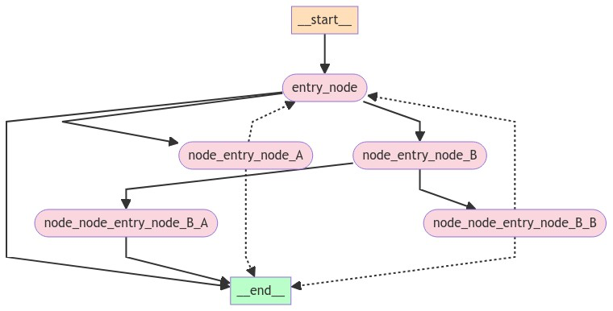

# 可视化

此笔记本介绍了如何可视化您创建的图形。这适用于任何图。

```markdown
%%capture --no-stderr
%pip install -U langgraph
```


## 设置图形

您可以可视化任何任意的图形，包括StateGraph和MessageGraph。

让我们通过绘制分形图形来玩得开心

```python
import random
from langgraph.graph import StateGraph
from langgraph.graph.message import add_messages
from typing_extensions import TypedDict
from typing import Annotated, Literal


class State(TypedDict):
    messages: Annotated[list, add_messages]


class MyNode:
    def __init__(self, name: str):
        self.name = name

    def __call__(self, state: State):
        return {"messages": [("assistant", f"Called node {self.name}")]}


def route(state) -> Literal["entry_node", "__end__"]:
    if len(state["messages"]) > 10:
        return "__end__"
    return "entry_node"


def add_fractal_nodes(builder, current_node, level, max_level):
    if level > max_level:
        return

    # Number of nodes to create at this level
    num_nodes = random.randint(1, 3)  # Adjust randomness as needed
    for i in range(num_nodes):
        nm = ["A", "B", "C"][i]
        node_name = f"node_{current_node}_{nm}"
        builder.add_node(node_name, MyNode(node_name))
        builder.add_edge(current_node, node_name)

        # Recursively add more nodes
        r = random.random()
        if r > 0.2 and level + 1 < max_level:
            add_fractal_nodes(builder, node_name, level + 1, max_level)
        elif r > 0.05:
            builder.add_conditional_edges(node_name, route, node_name)
        else:
            # End
            builder.add_edge(node_name, "__end__")


def build_fractal_graph(max_level: int):
    builder = StateGraph(State)
    entry_point = "entry_node"
    builder.add_node(entry_point, MyNode(entry_point))
    builder.set_entry_point(entry_point)

    add_fractal_nodes(builder, entry_point, 1, max_level)

    # Optional: set a finish point if required
    builder.set_finish_point(entry_point)  # or any specific node

    return builder.compile()


app = build_fractal_graph(3)
```


```python
app.get_graph().print_ascii()

```

## ASCII
我们可以轻松地使用 ASCII 来可视化这个图。


```markdown
+-----------+                                                               
                                                                           | __start__ |                                                               
                                                                           +-----------+                                                               
                                                                                  *                                                                    
                                                                                  *                                                                    
                                                                                  *                                                                    
                                                                          +------------+                                                               
                                                                    ******| entry_node |..*****                                                        
                                                        ************ *****+------------+  ......***********                                            
                                           *************        *****             .             .....      ************                                
                               ************               ******                  .                  .....             ************                    
                        *******                      *****                        .                       ......                   ************        
    +-------------------+                         ***                            ..                             ...                            ******* 
    | node_entry_node_B |*********                  **                        ...                                 .                                  * 
    +-------------------+         ******************* **                   ...                                    .                                  * 
              *                                      *******************...                                       .                                  * 
              *                                           **         ...*******************                       .                                  * 
              *                                             **     ..                      **********             .                                  * 
+--------------------------+                         +-------------------+                          +--------------------------+                ****** 
| node_node_entry_node_B_A |***                      | node_entry_node_A |                          | node_node_entry_node_B_B |      **********       
+--------------------------+   **********            +-------------------+                          +--------------------------+******                 
                                         **********                     ...                    .....             **********                            
                                                   **********              ...           ......       ***********                                      
                                                             **********       ..      ...   **********                                                 
                                                                       *****+---------+*****                                                           
                                                                            | __end__ |                                                                
                                                                            +---------+          
```

## Mermaid
我们也可以将图类转换为 Mermaid 语法。


```python
print(app.get_graph().draw_mermaid())
```
```markdown
%%{init: {'flowchart': {'curve': 'linear'}}}%%
graph TD;
	__start__[__start__]:::startclass;
	__end__[__end__]:::endclass;
	entry_node([entry_node]):::otherclass;
	node_entry_node_A([node_entry_node_A]):::otherclass;
	node_entry_node_B([node_entry_node_B]):::otherclass;
	node_node_entry_node_B_A([node_node_entry_node_B_A]):::otherclass;
	node_node_entry_node_B_B([node_node_entry_node_B_B]):::otherclass;
	__start__ --> entry_node;
	entry_node --> __end__;
	entry_node --> node_entry_node_A;
	entry_node --> node_entry_node_B;
	node_entry_node_B --> node_node_entry_node_B_A;
	node_entry_node_B --> node_node_entry_node_B_B;
	node_node_entry_node_B_A --> __end__;
	node_entry_node_A -.-> entry_node;
	node_entry_node_A -.-> __end__;
	node_node_entry_node_B_B -.-> entry_node;
	node_node_entry_node_B_B -.-> __end__;
	classDef startclass fill:#ffdfba;
	classDef endclass fill:#baffc9;
	classDef otherclass fill:#fad7de;
```


## PNG


如果需要的话，我们可以将图渲染成 .png。在这里，我们有三个选项：

使用 Mermaid.ink API（不需要额外的包）
使用 Mermaid + Pyppeteer（需要 pip install pyppeteer）
使用 Graphviz（需要 pip install graphviz）


## 使用Mermaid.Ink¶

默认情况下，draw_mermaid_png() 使用 Mermaid.Ink 的 API 生成图表。

```python
from langchain_core.runnables.graph import CurveStyle, NodeColors, MermaidDrawMethod
from IPython.display import display, HTML, Image

display(
    Image(
        app.get_graph().draw_mermaid_png(
            draw_method=MermaidDrawMethod.API,
        )
    )
)
```




## 使用 Graphviz
```markdown
%%capture --no-stderr
%pip install pygraphviz
```

```python
display(Image(app.get_graph().draw_png()))
```


